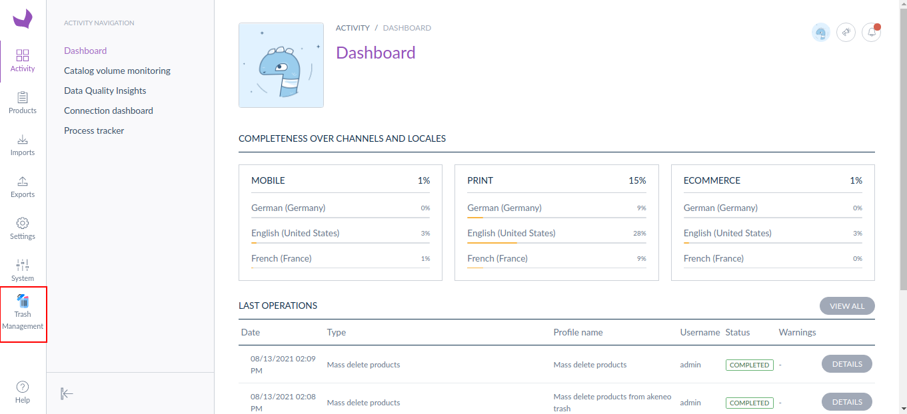
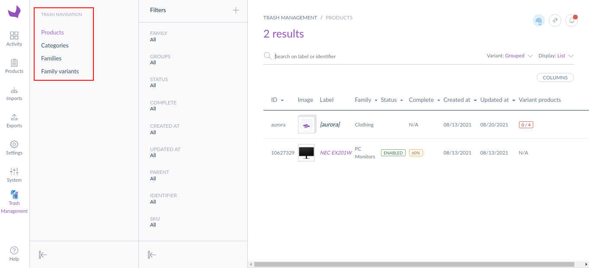
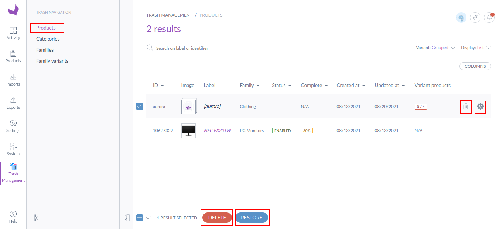

Akeneo Trash Management
=====================================

Akeneo Trash Management is a module that allows you to restore your deleted products, categories, familes, and family variants from the Akeneo PIM setup.

If you or any of your catalog team members have accidentally deleted the product from the Akeneo PIM setup, you will require some option that restores the specific product and bring it back to the Akeneo PIM setup and that's where this extension helps.

There is a separate grid is maintaining called "Trash Management" which stores and showcase all the deleted products, categories, familes, and family variants in the grid along with two options - Restore and Permanently Delete

1) If you want your product back so just click on the restore button from this grid, it will restore the products from this trash management grid to the Akeneo product management grid.

2) If you don't want to continue with a specific product and want that product gets deleted permanently just click on the delete forever button. This will delete the product from the Akeneo set up permanently.

Installation instructions
-------------------------

* First, install the package with the following command.
```bash
composer require krishtechnolabs/akeneo-trash-bundle
```
* Register the module in the config/bundles.php
``` php
KTPL\AkeneoTrashBundle\AkeneoTrashBundle::class => ['all' => true],
```
* Now that you have activated and configured the bundle, now all you need to do is import the AkeneoTrashBundle routing files.

``` yml
# config/routes/ktpl_akeneo_trash.yml
ktpl_akeneo_trash:
    resource: "@AkeneoTrashBundle/Resources/config/routing.yml"
    prefix: /
```

* Now, run the below command from the terminal from the installation directory.

```bash
php bin/console cache:clear && php bin/console ktpl:install:akeneotrash
```

How to use it
--------------
* To see how Akeneo PIM trash management works, the first step you will require to do is remove/delete any product from the Akeneo PIM products grid

* After that click on the Trash Management Menu.


* Once you click on the Krish Trash menu, the "Trash Management" product grid will be displayed. This grid will display all the deleted products which you have deleted from the Akeneo main products grid.


* In the trash management grid you can perform the following two actions :
    1) Restore the deleted products from trash management grid to the Akeneo Main product management grid
    2) Delete/Remove the products permanently from the Akeneo PIM setup

You can also use bulk actions to perform bulk delete and bulk restore. With the help of the bulk actions, you can delete or restore multiple products at once (the daemon consumer must be in the running state in the background to see the changes).